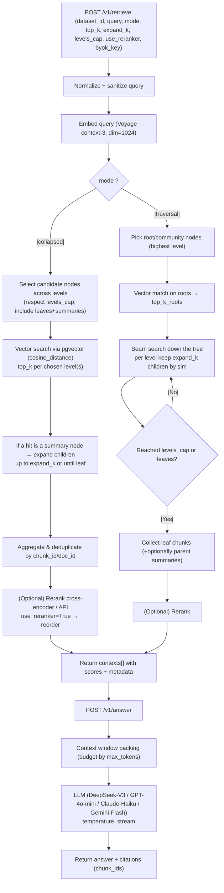
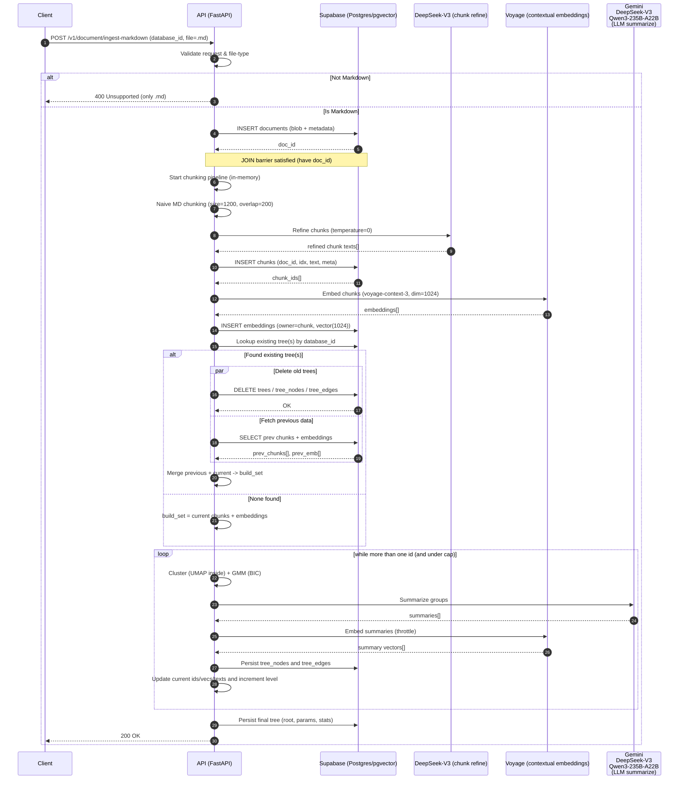
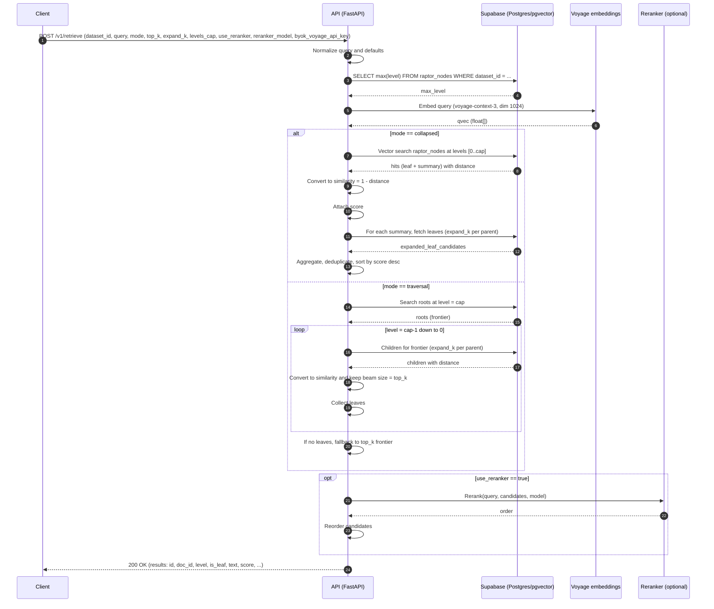
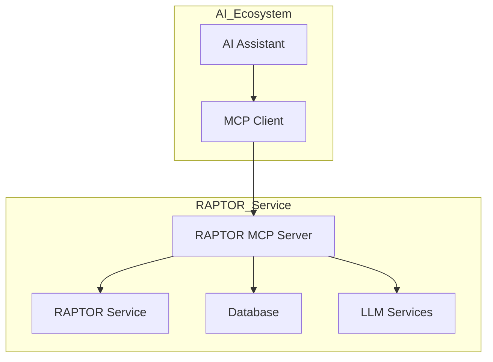

# RAPTOR Service – Build Pipeline Report (Upload → Tree Build)

> **Scope:** Tài liệu mô tả _end-to-end_ pipeline của **Raptor-service** từ lúc **upload dữ liệu** đến khi **xây cây RAPTOR** (tree building). Bao gồm kiến trúc, API, tham số, kiểm thử nhanh, và sơ đồ trực quan (Mermaid).

---

## 0) Bối cảnh & Mục tiêu

- **RAPTOR** (Recursive Abstractive Processing for Tree-Organized Retrieval) xây cây tóm tắt phân cấp bằng cách **embed → giảm chiều (UMAP) → phân cụm (GMM+BIC) → tóm tắt bằng LLM → re-embed**, lặp lại theo tầng cho tới khi dừng.
- Dịch vụ **Raptor-service** cung cấp API độc lập để **nhận các chunk** (có thể đã embed) và **xây tree**; kèm retrieval sau này.

> Tham chiếu: phương pháp RAPTOR (arXiv 2401.18059) và cấu trúc repo + I/O spec của dự án.

---

## 1) Kiến trúc cấp cao (High-level)

**Thành phần logic chính** (theo cấu trúc thư mục):

- `app/` – **FastAPI**: khởi tạo app, container DI, settings, include routers.
- `services/` – luồng nghiệp vụ: `build_tree_service.py` (xây cây)
- `infra/` – hạ tầng: `embeddings/` (backend tạo vector), `llm/` (gọi model tóm tắt), `db/` (ORM/Unit of Work), `uow/`.
- `interfaces_adaptor/` – adapter: HTTP, gateways, repository, client.
- `tests/` – test API (build/retrieve), factories payload.
- `alembic/` + `Database.md` – lược đồ DB & migration.
- `utils` - các hàm tiện ích dùng chung
- `logs` - thư mục chứa log dùng để trace và debug
- `constants` - thư mục chứa các biến cố định như prompt

### 1.1 Sơ đồ dòng dữ liệu (upload → build)

```mermaid
flowchart TD
    %% Gate: only .md
    A["Client Upload<br/>(.md or other)"] --> B{"Is Markdown (.md)?"}
    B -- "No" --> R["Return error/unsupported<br/>(only .md accepted)"]
    B -- "Yes" --> P["Start .md pipeline"]

    %% Start two tracks: Save doc and Pre-chunk in memory
    P --> D1["Save original document<br/>(blob + metadata)<br/>(returns doc_id)"]
    P --> T0["Start chunking pipeline"]

    %% Chunking & refinement (DeepSeek V3 @ temp=0)
    subgraph CH ["Chunking & Refinement"]
      direction TB
      T0 --> T1["Naive Markdown chunking<br/>(RecursiveCharacterTextSplitter)"]
      T1 --> T2["LLM-guided refinement<br/>(DeepSeek-V3, temperature = 0)"]
      T2 --> T3["Prepare chunk texts[]"]
    end

    %% Join barrier: must have doc_id before persisting chunks/embeddings
    D1 --> J["JOIN: doc_id available"]
    T3 --> J
    J --> C3["Persist chunks to Supabase<br/>(chunks table; doc_id FK)"]

    %% Embedding strictly after chunking
    C3 --> E1["Contextualized embeddings (Voyage)<br/>model: voyage-context-3; output_dimension = 1024"]
    E1 --> E2["Persist embeddings to Supabase<br/>(embeddings table; vector(1024))"]

    %% Rebuild decision by database_id (before RAPTOR build)
    E2 --> Q0["Lookup by database_id<br/>(documents/chunks/embeddings & existing tree)"]
    Q0 -- "None found" --> B0["Build set = current chunks + embeddings"]

    %% PARALLEL: delete old tree(s) and fetch previous chunks+embeddings
    Q0 -- "Found" --> PAR_FORK["Fork: cleanup & load in parallel"]
    subgraph PAR ["Parallel cleanup & load"]
      direction LR
      PAR_FORK --> TDEL["Delete old tree(s)<br/>(for database_id)"]
      PAR_FORK --> FOLD["Fetch previous chunks + embeddings<br/>(by database_id)"]
      TDEL --> J2["Join: both complete"]
      FOLD --> J2
    end

    %% Build set after join
    J2 --> MRG["Merge: previous + current → build set"]

    %% Continue RAPTOR build with the chosen build set
    B0 --> V["Validate embeddings<br/>(dim = 1024; choose distance op)"]
    MRG --> V
    V --> L0["Init: level = 0<br/>current_ids/vecs/texts = build set"]
subgraph RL["RAPTOR level loop"]
  direction TB
  L0 --> CL["Cluster (includes UMAP) + GMM<br/>(fit_predict: min_k..max_k; criterion = BIC)<br/>logs: clusters, sizes, best_score"]
  CL --> S["Summarize groups<br/>(_summarize_groups; async via sem)"]
  S --> E["Embed summaries<br/>(_embed_with_throttle; min_interval)"]
  E --> AH["Persist level<br/>(_persist_level: commit nodes & edges)<br/>update current_ids/vecs/texts; level = level + 1"]
  AH --> CHK{"len(current_ids) > 1 ?"}
end

CHK -- "Yes → next level" --> CL
CHK -- "No → done" --> OUT["Finish build<br/>(persist final tree & index)"]

```



### 1.2 Sơ đồ dòng truy vấn



### 1.3 Sơ đồ trình tự (Async build)





---

## 2) API – hợp đồng I/O

### 2.1 Build cây – `POST /v1/document/ingest-markdown`

**Content-Type:** `multipart/form-data`

**Mô tả:** Upload **Markdown (.md)** kèm metadata dạng form. Hệ thống sẽ:

1. Lưu document để lấy `doc_id` (JOIN barrier)
2. Chunk → refine (LLM) → embed (Voyage 1024d) → index
3. (Nếu `build_tree=true`) build RAPTOR tree và trả `tree_id`

> Yêu cầu: cài `python-multipart` để FastAPI nhận form + file.

---

## Headers (tuỳ chọn)

- `X-Dataset-Id`: ID dataset từ header (backend có thể cho phép ghi đè/ưu tiên theo chính sách).

---

## Form fields

| Trường         | Kiểu                                         | Bắt buộc | Mặc định   | Ghi chú                             |
| -------------- | -------------------------------------------- | -------: | ---------- | ----------------------------------- |
| `file`         | `UploadFile` (.md)                           |       ✔︎ | –          | Chỉ nhận **Markdown**               |
| `dataset_id`   | `string`                                     |       ✔︎ | –          | ID bộ dữ liệu                       |
| `source`       | `string`                                     |       ✖︎ | –          | Nguồn gốc tài liệu (URL, path, …)   |
| `tags`         | `string[]`                                   |       ✖︎ | –          | Gửi lặp nhiều field `tags` nếu cần  |
| `extra_meta`   | `string` (JSON)                              |       ✖︎ | –          | JSON encode, vd: `{"author":"..."}` |
| `build_tree`   | `bool`                                       |       ✖︎ | `true`     | `true` → build RAPTOR tree          |
| `summary_llm`  | `string`/enum                                |       ✖︎ | –          | Model tóm tắt (vd: `deepseek_v3`)   |
| `vector_index` | `string`                                     |       ✖︎ | –          | Tên/khoá cấu hình index vector      |
| `upsert_mode`  | `"upsert" \| "replace" \| "skip_duplicates"` |       ✖︎ | `"upsert"` | Chiến lược ghi dữ                   |

---

## Ví dụ cURL

```
curl -X POST "$HOST/v1/document/ingest-markdown"   -H "X-Dataset-Id: ds_demo"   -H "Accept: application/json"   -F "dataset_id=ds_demo"   -F "file=@/path/to/readme.md;type=text/markdown"   -F "source=https://example.com/readme.md"   -F "tags=docs" -F "tags=markdown"   -F 'extra_meta={"category":"guide"}'   -F "build_tree=true"   -F "summary_llm=deepseek_v3"   -F "vector_index=hnsw_cosine"   -F "upsert_mode=upsert"   -F "byok_voyage_api_key=****"
```

---

## Response (200 OK)

```json
{
  "code": 200,
  "data": {
    "doc_id": "d216eea618c84093baae2ec68961f35a",
    "dataset_id": "ds_demo",
    "status": "embedded",
    "chunks": 81,
    "indexed": {
      "upserted": 81
    },
    "tree_id": "d216eea618c84093baae2ec68961f35a::tree",
    "checksum": "0ca1fa7fa265142bb573aa7a99926f4c8430748ffe9f888cde8cb81e93b30551"
  }
}
```

### Mã lỗi phổ biến

- `400 BAD_REQUEST` – File không phải `.md`, thiếu `dataset_id`, hoặc form không hợp lệ.
- `415 UNSUPPORTED_MEDIA_TYPE` – Không gửi `multipart/form-data`.
- `422 UNPROCESSABLE_ENTITY` – Sai kiểu dữ liệu form/header theo schema FastAPI.
- `500 INTERNAL` – Lỗi nội bộ khi chunking/embedding/indexing.

---

### 2.2 Truy xuất dữ liệu – `POST /v1/document/retrieve`

**Content-Type:** `application/json`

**Mô tả:** Truy xuất các đoạn văn bản liên quan đến truy vấn từ cơ sở tri thức.

---

## Request Body

| Trường                | Kiểu     | Bắt buộc | Mặc định      | Ghi chú                                        |
| --------------------- | -------- | -------: | ------------- | ---------------------------------------------- |
| `dataset_id`          | `string` |       ✔︎ | –             | ID bộ dữ liệu                                  |
| `query`               | `string` |       ✔︎ | –             | Truy vấn tìm kiếm                              |
| `mode`                | `string` |       ✖︎ | `"collapsed"` | `"collapsed"` hoặc `"traversal"`               |
| `top_k`               | `int`    |       ✖︎ | `8`           | Số lượng đoạn văn bản trả về                   |
| `expand_k`            | `int`    |       ✖︎ | `5`           | Số lượng node mở rộng (chỉ với mode collapsed) |
| `levels_cap`          | `int`    |       ✖︎ | `0`           | Giới hạn cấp độ cây (chỉ với mode traversal)   |
| `use_reranker`        | `bool`   |       ✖︎ | `false`       | Có sử dụng reranker không                      |
| `reranker_model`      | `string` |       ✖︎ | –             | Model reranker                                 |
| `byok_voyage_api_key` | `string` |       ✖︎ | –             | API key Voyage tự cung cấp                     |

---

## Ví dụ Request

```json
{
  "dataset_id": "ds_demo",
  "query": "Hướng dẫn cài đặt hệ thống",
  "mode": "collapsed",
  "top_k": 5,
  "expand_k": 3
}
```

---

## Response (200 OK)

```json
{
  "code": 200,
  "data": [
    {
      "chunk_id": "c123",
      "doc_id": "d456",
      "text": "Để cài đặt hệ thống, bạn cần thực hiện các bước sau...",
      "dist": 0.234
    }
  ]
}
```

---

### 2.3 Truy xuất và trả lời – `POST /v1/document/answer`

**Content-Type:** `application/json`

**Mô tả:** Truy xuất thông tin liên quan và tạo câu trả lời từ LLM.

---

## Request Body

| Trường                | Kiểu     | Bắt buộc | Mặc định        | Ghi chú                                        |
| --------------------- | -------- | -------: | --------------- | ---------------------------------------------- |
| `dataset_id`          | `string` |       ✔︎ | –               | ID bộ dữ liệu                                  |
| `query`               | `string` |       ✔︎ | –               | Truy vấn tìm kiếm                              |
| `mode`                | `string` |       ✖︎ | `"collapsed"`   | `"collapsed"` hoặc `"traversal"`               |
| `top_k`               | `int`    |       ✖︎ | `8`             | Số lượng đoạn văn bản truy xuất                |
| `expand_k`            | `int`    |       ✖︎ | `5`             | Số lượng node mở rộng (chỉ với mode collapsed) |
| `levels_cap`          | `int`    |       ✖︎ | `0`             | Giới hạn cấp độ cây (chỉ với mode traversal)   |
| `use_reranker`        | `bool`   |       ✖︎ | `false`         | Có sử dụng reranker không                      |
| `reranker_model`      | `string` |       ✖︎ | –               | Model reranker                                 |
| `byok_voyage_api_key` | `string` |       ✖︎ | –               | API key Voyage tự cung cấp                     |
| `answer_model`        | `string` |       ✖︎ | `"DeepSeek-V3"` | Model LLM để tạo câu trả lời                   |
| `temperature`         | `float`  |       ✖︎ | `0.3`           | Độ sáng tạo của LLM                            |
| `max_tokens`          | `int`    |       ✖︎ | `4000`          | Số token tối đa trong câu trả lời              |
| `stream`              | `bool`   |       ✖︎ | `false`         | Trả về kết quả theo luồng (stream)             |

---

## Ví dụ Request

```json
{
  "dataset_id": "ds_demo",
  "query": "Hướng dẫn cài đặt hệ thống",
  "mode": "collapsed",
  "top_k": 5,
  "answer_model": "DeepSeek-V3",
  "temperature": 0.7,
  "max_tokens": 2000
}
```

---

## Response (200 OK)

```json
{
  "answer": "Để cài đặt hệ thống, bạn cần thực hiện các bước sau...",
  "model": "DeepSeek-V3",
  "top_k": 5,
  "mode": "collapsed",
  "passages": [
    {
      "chunk_id": "c123",
      "doc_id": "d456",
      "text": "Để cài đặt hệ thống, bạn cần thực hiện các bước sau..."
    }
  ]
}
```

---

### 2.4 Quản lý Dataset – `GET /v1/datasets`

**Mô tả:** Liệt kê tất cả các dataset/knowledge base có sẵn.

---

## Response (200 OK)

```json
{
  "datasets": [
    {
      "id": "ds_demo",
      "name": "ds_demo",
      "description": "Knowledge base with 5 documents",
      "document_count": 5,
      "created_at": "2023-01-01T00:00:00Z",
      "last_updated": "2023-01-02T00:00:00Z"
    }
  ],
  "total": 1
}
```

---

### 2.5 Chi tiết Dataset – `GET /v1/datasets/{dataset_id}`

**Mô tả:** Lấy thông tin chi tiết về một dataset cụ thể.

---

## Response (200 OK)

```json
{
  "id": "ds_demo",
  "name": "ds_demo",
  "description": "Knowledge base containing 5 documents",
  "document_count": 5,
  "chunk_count": 120,
  "embedding_count": 120,
  "tree_count": 1,
  "created_at": "2023-01-01T00:00:00Z",
  "last_updated": "2023-01-02T00:00:00Z",
  "status": "active"
}
```

---

### 2.6 Quản lý Trợ lý AI – `POST /v1/ai/assistants`

**Content-Type:** `application/json`

**Mô tả:** Tạo một trợ lý AI mới với cấu hình cụ thể.

---

## Request Body

| Trường            | Kiểu       | Bắt buộc | Ghi chú                                       |
| ----------------- | ---------- | -------: | --------------------------------------------- |
| `name`            | `string`   |       ✔︎ | Tên trợ lý (3-100 ký tự)                      |
| `description`     | `string`   |       ✖︎ | Mô tả trợ lý (tối đa 500 ký tự)               |
| `knowledge_bases` | `string[]` |       ✔︎ | Danh sách ID dataset (ít nhất 1)              |
| `model_settings`  | `object`   |       ✔︎ | Cấu hình model                                |
| `user_id`         | `string`   |       ✖︎ | ID người dùng (cho quản lý tương lai)         |
| `system_prompt`   | `string`   |       ✖︎ | Prompt hệ thống tùy chỉnh (tối đa 2000 ký tự) |

---

## Model Settings Object

| Trường             | Kiểu     | Bắt buộc | Mặc định | Ghi chú                                 |
| ------------------ | -------- | -------: | -------- | --------------------------------------- |
| `model`            | `string` |       ✔︎ | –        | Tên model (vd: "gpt-4o", "DeepSeek-V3") |
| `temperature`      | `float`  |       ✖︎ | `0.7`    | Độ sáng tạo (0.0 - 2.0)                 |
| `topP`             | `float`  |       ✖︎ | `1.0`    | Top P (0.0 - 1.0)                       |
| `presencePenalty`  | `float`  |       ✖︎ | `0.0`    | Penalty sự hiện diện (-2.0 - 2.0)       |
| `frequencyPenalty` | `float`  |       ✖︎ | `0.0`    | Penalty tần suất (-2.0 - 2.0)           |

---

## Ví dụ Request

```json
{
  "name": "Trợ lý tài liệu",
  "description": "Trợ lý giúp trả lời câu hỏi về tài liệu",
  "knowledge_bases": ["ds_demo"],
  "model_settings": {
    "model": "DeepSeek-V3",
    "temperature": 0.7,
    "topP": 1.0,
    "presencePenalty": 0.0,
    "frequencyPenalty": 0.0
  }
}
```

---

## Response (200 OK)

```json
{
  "code": 201,
  "data": {
    "assistant_id": "a1b2c3d4-e5f6-7890-g1h2-i3j4k5l6m7n8",
    "user_id": null,
    "name": "Trợ lý tài liệu",
    "description": "Trợ lý giúp trả lời câu hỏi về tài liệu",
    "knowledge_bases": ["ds_demo"],
    "model_settings": {
      "model": "DeepSeek-V3",
      "temperature": 0.7,
      "topP": 1.0,
      "presencePenalty": 0.0,
      "frequencyPenalty": 0.0
    },
    "system_prompt": null,
    "status": "active",
    "meta": null,
    "created_at": "2023-01-01T00:00:00Z",
    "updated_at": "2023-01-01T00:00:00Z"
  },
  "message": "Assistant created successfully"
}
```

---

### 2.7 Chat – `POST /v1/datasets/chat/sessions`

**Content-Type:** `application/json`

**Mô tả:** Tạo một phiên chat mới với một dataset cụ thể.

---

## Request Body

| Trường             | Kiểu     | Bắt buộc | Mặc định     | Ghi chú                   |
| ------------------ | -------- | -------: | ------------ | ------------------------- |
| `dataset_id`       | `string` |       ✔︎ | –            | ID dataset để chat        |
| `title`            | `string` |       ✖︎ | `"New Chat"` | Tiêu đề phiên chat        |
| `user_id`          | `string` |       ✖︎ | –            | ID người dùng             |
| `assistant_id`     | `string` |       ✖︎ | –            | ID trợ lý AI              |
| `assistant_config` | `object` |       ✖︎ | –            | Cấu hình trợ lý tùy chỉnh |

---

## Ví dụ Request

```json
{
  "dataset_id": "ds_demo",
  "title": "Phiên chat tài liệu",
  "assistant_config": {
    "model": "DeepSeek-V3",
    "temperature": 0.7,
    "max_tokens": 4000,
    "top_k": 5,
    "mode": "tree"
  }
}
```

---

## Response (200 OK)

```json
{
  "code": 200,
  "data": {
    "session_id": "s1a2b3c4-d5e6-f7g8-h9i0-j1k2l3m4n5o6",
    "title": "Phiên chat tài liệu",
    "dataset_id": "ds_demo",
    "assistant_id": null,
    "status": "active",
    "assistant_config": {
      "model": "DeepSeek-V3",
      "temperature": 0.7,
      "max_tokens": 4000,
      "top_k": 5,
      "mode": "tree"
    },
    "created_at": "2023-01-01T00:00:00Z",
    "message_count": 0
  }
}
```

---

### 2.8 Gửi tin nhắn chat – `POST /v1/datasets/chat/chat`

**Content-Type:** `application/json`

**Mô tả:** Gửi một tin nhắn và nhận phản hồi từ AI với ngữ cảnh chat.

---

## Request Body

| Trường         | Kiểu     | Bắt buộc | Mặc định        | Ghi chú                            |
| -------------- | -------- | -------: | --------------- | ---------------------------------- |
| `dataset_id`   | `string` |       ✔︎ | –               | ID dataset                         |
| `query`        | `string` |       ✔︎ | –               | Nội dung tin nhắn                  |
| `session_id`   | `string` |       ✖︎ | –               | ID phiên chat (nếu có)             |
| `mode`         | `string` |       ✖︎ | `"tree"`        | `"tree"` hoặc `"traversal"`        |
| `top_k`        | `int`    |       ✖︎ | `8`             | Số lượng đoạn văn bản truy xuất    |
| `expand_k`     | `int`    |       ✖︎ | `5`             | Số lượng node mở rộng              |
| `answer_model` | `string` |       ✖︎ | `"DeepSeek-V3"` | Model LLM để tạo câu trả lời       |
| `temperature`  | `float`  |       ✖︎ | `0.7`           | Độ sáng tạo của LLM                |
| `max_tokens`   | `int`    |       ✖︎ | `4000`          | Số token tối đa trong câu trả lời  |
| `stream`       | `bool`   |       ✖︎ | `false`         | Trả về kết quả theo luồng (stream) |

---

## Ví dụ Request

```json
{
  "dataset_id": "ds_demo",
  "query": "Hướng dẫn cài đặt hệ thống",
  "session_id": "s1a2b3c4-d5e6-f7g8-h9i0-j1k2l3m4n5o6",
  "mode": "tree",
  "top_k": 5,
  "answer_model": "DeepSeek-V3",
  "temperature": 0.7
}
```

---

## Response (200 OK)

```
{
  "answer": "Để cài đặt hệ thống, bạn cần thực hiện các bước sau...",
  "model": "DeepSeek-V3",
  "top_k": 5,
  "mode": "tree",
  "passages": [
    {
      "chunk_id": "c123",
      "doc_id": "d456",
      "text": "Để cài đặt hệ thống, bạn cần thực hiện các bước sau..."
    }
  ],
  "session_id": "s1a2b3c4-d5e6-f7g8-h9i0-j1k2l3m4n5o6",
  "processing_time_ms": 1250,
  "user_message": {
    "message_id": "m1a2b3c4-d5e6-f7g8-h9i0-j1k2l3m4n5o6",
    "session_id": "s1a2b3c4-d5e6-f7g8-h9i0-j1k2l3m4n5o6",
    "role": "user",
    "content": "Hướng dẫn cài đặt hệ thống",
    "created_at": "2023-01-01T00:00:00Z"
  },
  "assistant_message": {
    "message_id": "m2a3b4c5-d6e7-f8g9-h0i1-j2k3l4m5n6o7",
    "session_id": "s1a2b3c4-d5e6-f7g8-h9i0-j1k2l3m4n5o6",
    "role": "assistant",
    "content": "Để cài đặt hệ thống, bạn cần thực hiện các bước sau...",
    "context_passages": [
      {
        "chunk_id": "c123",
        "doc_id": "d456",
        "text": "Để cài đặt hệ thống, bạn cần thực hiện các bước sau..."
      }
    ],
    "model_used": "DeepSeek-V3",
    "processing_time_ms": 1250,
    "created_at": "2023-01-01T00:00:01Z"
  }
}
```

---

### 2.9 (Ngoài phạm vi build) Retrieve/Answer ( Chưa implement)

- `POST /v1/retrieve`: `mode=collapsed|tree_traversal`, có `reranker`.
- `POST /v1/answer`: kết hợp retrieve + generate (LLM), tuỳ chọn stream NDJSON/SSE.

---

## 3) Postman Collection

Bạn có thể tải xuống file Postman Collection để test các API: [postman_collection.json](postman_collection.json)

Để sử dụng collection này:

1. Mở Postman
2. Chọn "Import" → "Upload Files"
3. Chọn file `postman_collection.json` đã tải xuống
4. Cập nhật biến `base_url` trong collection để trỏ đến server của bạn
5. Bắt đầu test các API

---

## 5) Stages chi tiết của Build

### Stage 0 – Upload gate & Persist Document

- Chỉ chấp nhận **`.md`**; nếu không phải `.md` → trả lỗi _unsupported_.
- Lưu **document gốc** để lấy **`doc_id`**; đây là **JOIN barrier** bắt buộc trước khi persist các chunk/embedding (mọi record con sẽ FK theo `doc_id`).

### Stage 1 – Chunking & LLM refinement (in-memory)

- **Naive Markdown chunking** (ví dụ: `size=1200`, `overlap=200`, `separators`, `keep_separator`) để cắt khối văn bản theo cấu trúc MD.
- **Refine bằng LLM** (DeepSeek-V3, `temperature=0`) để “sạch nhiễu”, điều chỉnh ranh giới chunk theo ngữ nghĩa; tạo `chunk_texts[]` sẵn sàng persist.

### Stage 2 – Persist chunks

- Ghi **chunks** vào DB (Supabase/Postgres)
- Đảm bảo **unique (`doc_id`, `idx`)** để truy vết & cập nhật ổn định.

### Stage 3 – Contextual Embedding & Persist embeddings

- Tạo **contextual embeddings** cho các chunk (Voyage, **`dim=1024`**), sau đó persist vào bảng embeddings (chủ sở hữu = `chunk`, `vector(1024)`).

### Stage 4 – Rebuild decision theo `database_id`

- **Lookup** trong DB xem `database_id` đã có tree trước đó chưa.
  - **Không tìm thấy (build new tree)** → `build_set =` _current chunks + embeddings_.
  - **Có (rebuild)** → **chạy song song**:
    - Nhánh 1: **Xoá tree cũ** (trees/tree_nodes/tree_edges) theo `database_id`.
    - Nhánh 2: **Fetch** các _previous chunks + embeddings_ theo `database_id`.
- **Join** hai nhánh, sau đó **merge previous + current → build_set**.

### Stage 5 – RAPTOR per-level loop (UMAP inside Clustering)

Vòng lặp theo tầng chạy đến khi đạt điều kiện dừng:

1. **Cluster (UMAP inside) + GMM**
   - Giảm chiều bằng **UMAP** để ổn định cấu trúc cụm rồi phân cụm bằng **GMM**; chọn số cụm bằng **BIC** (giới hạn `min_k..max_k` theo cấu hình). :contentReference[oaicite:1]{index=1}
2. **Summarize groups** bằng LLM để tạo **summary nodes** cho từng cụm.
3. **Embed summaries** (có thể throttle) để tạo vector cho tầng kế tiếp.
4. **Persist level**: ghi **tree_nodes**, **tree_edges**, cập nhật `current_ids/vecs/texts`, tăng `level`.

### Stage 6 – Điều kiện dừng

- Dừng khi **chỉ còn 1 node ** ở tầng hiện tại (_root đạt được_) **hoặc** đạt **`levels_cap`** (nếu cấu hình).

### Stage 7 – Finalize & Index

- Ghi **tree cuối** (root, params, stats).
- Để phục vụ retrieve/traversal sau này. :contentReference[oaicite:2]{index=2}

---

## 6) Mô hình dữ liệu

```mermaid
classDiagram
class Document {
+doc_id: string
+dataset_id: string
+source: text
+tags: jsonb
+extra_meta: jsonb
+checksum: string
+text: text
+created_at: timestamptz
}

    class Chunk {
      +id: string
      +doc_id: string
      +idx: int
      +text: text
      +token_cnt: int
      +hash: string
      +meta: jsonb
      +created_at: timestamptz
    }

    class EmbeddingOwnerType {
      +values: "chunk | tree_node"
    }

    class Embedding {
      +id: string
      +dataset_id: string
      +owner_type: EmbeddingOwnerType
      +owner_id: string
      +model: string
      +dim: int
      +v: vector
      +meta: jsonb
      +created_at: timestamptz
    }

    class Tree {
      +tree_id: string
      +doc_id: string
      +dataset_id: string
      +params: jsonb
      +created_at: timestamptz
    }

    class NodeKind {
      +values: "leaf | summary | root"
    }

    class TreeNode {
      +node_id: string
      +tree_id: string
      +level: int
      +kind: NodeKind
      +text: text
      +meta: jsonb
      +created_at: timestamptz
    }

    class TreeEdge {
      +parent_id: string
      +child_id: string
    }

    class TreeNodeChunk {
      +node_id: string
      +chunk_id: string
      +rank: int
    }

    class ChatSession {
      +session_id: string
      +user_id: string
      +assistant_id: string
      +dataset_id: string
      +title: string
      +status: ChatSessionStatus
      +assistant_config: jsonb
      +system_prompt: text
      +meta: jsonb
      +message_count: int
      +created_at: timestamptz
      +updated_at: timestamptz
    }

    class ChatMessage {
      +message_id: string
      +session_id: string
      +role: MessageRole
      +content: text
      +context_passages: jsonb
      +retrieval_query: text
      +model_used: string
      +generation_params: jsonb
      +meta: jsonb
      +token_count: int
      +processing_time_ms: int
      +created_at: timestamptz
    }

    class ChatContext {
      +context_id: string
      +session_id: string
      +context_messages: jsonb
      +context_size_tokens: int
      +max_context_tokens: int
      +summarized_history: text
      +last_message_id: string
      +created_at: timestamptz
      +updated_at: timestamptz
    }

    class MessageRole {
      +values: "user | assistant | system"
    }

    class ChatSessionStatus {
      +values: "active | archived | deleted"
    }

    class Assistant {
      +assistant_id: string
      +user_id: string
      +name: string
      +description: text
      +knowledge_bases: jsonb
      +model_settings: jsonb
      +system_prompt: text
      +status: AssistantStatus
      +meta: jsonb
      +created_at: timestamptz
      +updated_at: timestamptz
    }

    class AssistantStatus {
      +values: "active | inactive | deleted"
    }

    %% Relationships
    Document "1" *-- "0..*" Chunk : chunks
    Document "1" *-- "0..*" Tree : trees
    Tree "1" *-- "1..*" TreeNode : nodes
    ChatSession "1" *-- "0..*" ChatMessage : messages
    ChatSession --> Assistant : assistant

    %% M:N mapping
    TreeNodeChunk --> TreeNode : node
    TreeNodeChunk --> Chunk : chunk

    %% Edges between nodes
    TreeEdge --> TreeNode : parent
    TreeEdge --> TreeNode : child

    %% Polymorphic owner (dashed deps)
    Embedding ..> Chunk : owner_type=chunk
    Embedding ..> TreeNode : owner_type=tree_node

    %% Notes (use %% comments + note syntax)
    note for Chunk "Unique: (doc_id, idx)"
    note for Embedding "Index: (dataset_id, owner_type, owner_id)\nHNSW on v (cosine)"
```



---

## 7) Model Control Protocol (MCP) Integration

### Overview

The RAPTOR service supports integration with remote LLM services through the Model Context Protocol (MCP). This allows AI assistants to interact with the RAPTOR service and access its functionality through standardized tools.

### Architecture



### Available Tools

The RAPTOR MCP server exposes the following tools:

1. **ingest_document** - Ingest documents into datasets
2. **retrieve_documents** - Retrieve relevant documents from datasets
3. **answer_question** - Answer questions using RAPTOR's knowledge
4. **list_datasets** - List available datasets
5. **create_chat_session** - Create interactive chat sessions

### SSE Endpoint

The MCP server is accessible through a Server-Sent Events (SSE) endpoint at `/mcp/sse`.

### Example Client Usage

```language: python
import asyncio
from services.mcp.client_example import RaptorMCPClient

async def example_usage():
    async with RaptorMCPClient() as client:
        # Connect to SSE endpoint
        async for message in client.connect_sse():
            print(f"Received: {message}")

            # Call tools
            result = await client.call_tool(
                "ingest_document",
                dataset_id="ds_demo",
                file_content="Sample document content"
            )
            print(f"Result: {result}")

# Run the example
# asyncio.run(example_usage())
```

### Configuration

To enable MCP, ensure the required dependencies are installed:

```bash
pip install mcp[cli]
```

The MCP service is automatically initialized with the main FastAPI application.

### Extending MCP

To implement your own MCP server, refer to the example implementation in `services/mcp/example_mcp_server.py`. The MCP protocol follows the official Model Context Protocol specification.
