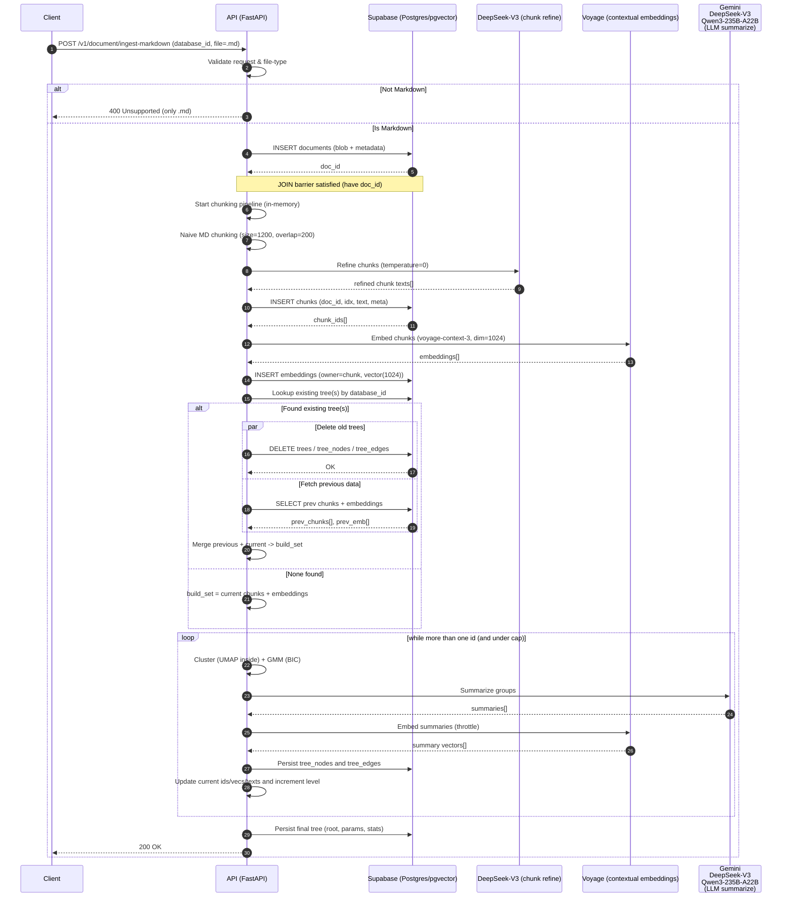
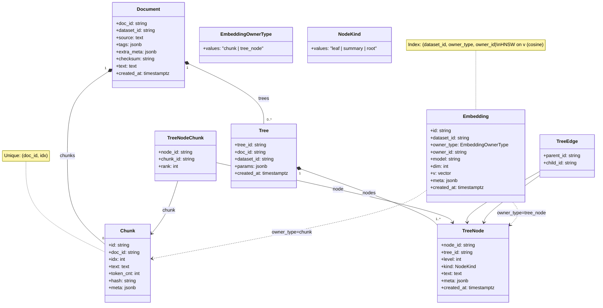

# RAPTOR Service – Build Pipeline Report (Upload → Tree Build)

> **Scope:** Tài liệu mô tả _end-to-end_ pipeline của **Raptor-service** từ lúc **upload dữ liệu** đến khi **xây cây RAPTOR** (tree building). Bao gồm kiến trúc, API, tham số, kiểm thử nhanh, và sơ đồ trực quan (Mermaid).

---

## 0) Bối cảnh & Mục tiêu

- **RAPTOR** (Recursive Abstractive Processing for Tree-Organized Retrieval) xây cây tóm tắt phân cấp bằng cách **embed → giảm chiều (UMAP) → phân cụm (GMM+BIC) → tóm tắt bằng LLM → re-embed**, lặp lại theo tầng cho tới khi dừng.
- Dịch vụ **Raptor-service** cung cấp API độc lập để **nhận các chunk** (có thể đã embed) và **xây tree**; kèm retrieval sau này.

> Tham chiếu: phương pháp RAPTOR (arXiv 2401.18059) và cấu trúc repo + I/O spec của dự án.

---

## 1) Kiến trúc cấp cao (High-level)

**Thành phần logic chính** (theo cấu trúc thư mục):

- `app/` – **FastAPI**: khởi tạo app, container DI, settings, include routers.
- `services/` – luồng nghiệp vụ: `build_tree_service.py` (xây cây)
- `infra/` – hạ tầng: `embeddings/` (backend tạo vector), `llm/` (gọi model tóm tắt), `db/` (ORM/Unit of Work), `uow/`.
- `interfaces_adaptor/` – adapter: HTTP, gateways, repository, client.
- `tests/` – test API (build/retrieve), factories payload.
- `alembic/` + `Database.md` – lược đồ DB & migration.
- `utils` - các hàm tiện ích dùng chung
- `logs` - thư mục chứa log dùng để trace và debug
- `constants` - thư mục chứa các biến cố định như prompt

### 1.1 Sơ đồ dòng dữ liệu (upload → build)

```mermaid
flowchart TD
    %% Gate: only .md
    A["Client Upload<br/>(.md or other)"] --> B{"Is Markdown (.md)?"}
    B -- "No" --> R["Return error/unsupported<br/>(only .md accepted)"]
    B -- "Yes" --> P["Start .md pipeline"]

    %% Start two tracks: Save doc and Pre-chunk in memory
    P --> D1["Save original document<br/>(blob + metadata)<br/>(returns doc_id)"]
    P --> T0["Start chunking pipeline"]

    %% Chunking & refinement (DeepSeek V3 @ temp=0)
    subgraph CH ["Chunking & Refinement"]
      direction TB
      T0 --> T1["Naive Markdown chunking<br/>(RecursiveCharacterTextSplitter)"]
      T1 --> T2["LLM-guided refinement<br/>(DeepSeek-V3, temperature = 0)"]
      T2 --> T3["Prepare chunk texts[]"]
    end

    %% Join barrier: must have doc_id before persisting chunks/embeddings
    D1 --> J["JOIN: doc_id available"]
    T3 --> J
    J --> C3["Persist chunks to Supabase<br/>(chunks table; doc_id FK)"]

    %% Embedding strictly after chunking
    C3 --> E1["Contextualized embeddings (Voyage)<br/>model: voyage-context-3; output_dimension = 1024"]
    E1 --> E2["Persist embeddings to Supabase<br/>(embeddings table; vector(1024))"]

    %% Rebuild decision by database_id (before RAPTOR build)
    E2 --> Q0["Lookup by database_id<br/>(documents/chunks/embeddings & existing tree)"]
    Q0 -- "None found" --> B0["Build set = current chunks + embeddings"]

    %% PARALLEL: delete old tree(s) and fetch previous chunks+embeddings
    Q0 -- "Found" --> PAR_FORK["Fork: cleanup & load in parallel"]
    subgraph PAR ["Parallel cleanup & load"]
      direction LR
      PAR_FORK --> TDEL["Delete old tree(s)<br/>(for database_id)"]
      PAR_FORK --> FOLD["Fetch previous chunks + embeddings<br/>(by database_id)"]
      TDEL --> J2["Join: both complete"]
      FOLD --> J2
    end

    %% Build set after join
    J2 --> MRG["Merge: previous + current → build set"]

    %% Continue RAPTOR build with the chosen build set
    B0 --> V["Validate embeddings<br/>(dim = 1024; choose distance op)"]
    MRG --> V
    V --> L0["Init: level = 0<br/>current_ids/vecs/texts = build set"]
subgraph RL["RAPTOR level loop"]
  direction TB
  L0 --> CL["Cluster (includes UMAP) + GMM<br/>(fit_predict: min_k..max_k; criterion = BIC)<br/>logs: clusters, sizes, best_score"]
  CL --> S["Summarize groups<br/>(_summarize_groups; async via sem)"]
  S --> E["Embed summaries<br/>(_embed_with_throttle; min_interval)"]
  E --> AH["Persist level<br/>(_persist_level: commit nodes & edges)<br/>update current_ids/vecs/texts; level = level + 1"]
  AH --> CHK{"len(current_ids) > 1 ?"}
end

CHK -- "Yes → next level" --> CL
CHK -- "No → done" --> OUT["Finish build<br/>(persist final tree & index)"]

```



### 1.2 Sơ đồ trình tự (Async build)



---

## 2) API – hợp đồng I/O

### 2.1 Build cây – `POST /v1/document/ingest-markdown`

**Content-Type:** `multipart/form-data`

**Mô tả:** Upload **Markdown (.md)** kèm metadata dạng form. Hệ thống sẽ:

1. Lưu document để lấy `doc_id` (JOIN barrier)
2. Chunk → refine (LLM) → embed (Voyage 1024d) → index
3. (Nếu `build_tree=true`) build RAPTOR tree và trả `tree_id`

> Yêu cầu: cài `python-multipart` để FastAPI nhận form + file.

---

## Headers (tuỳ chọn)

- `X-Dataset-Id`: ID dataset từ header (backend có thể cho phép ghi đè/ưu tiên theo chính sách).

---

## Form fields

| Trường                   | Kiểu                                         | Bắt buộc | Mặc định   | Ghi chú                             |
| ------------------------ | -------------------------------------------- | -------: | ---------- | ----------------------------------- |
| `file`                   | `UploadFile` (.md)                           |       ✔︎ | –          | Chỉ nhận **Markdown**               |
| `dataset_id`             | `string`                                     |       ✔︎ | –          | ID bộ dữ liệu                       |
| `source`                 | `string`                                     |       ✖︎ | –          | Nguồn gốc tài liệu (URL, path, …)   |
| `tags`                   | `string[]`                                   |       ✖︎ | –          | Gửi lặp nhiều field `tags` nếu cần  |
| `extra_meta`             | `string` (JSON)                              |       ✖︎ | –          | JSON encode, vd: `{"author":"..."}` |
| `build_tree`             | `bool`                                       |       ✖︎ | `true`     | `true` → build RAPTOR tree          |
| `summary_llm`            | `string`/enum                                |       ✖︎ | –          | Model tóm tắt (vd: `deepseek_v3`)   |
| `vector_index`           | `string`                                     |       ✖︎ | –          | Tên/khoá cấu hình index vector      |
| `upsert_mode`            | `"upsert" \| "replace" \| "skip_duplicates"` |       ✖︎ | `"upsert"` | Chiến lược ghi dữ liệu              |
| `byok_openai_api_key`    | `string`                                     |       ✖︎ | –          | BYOK                                |
| `byok_azure_openai`      | `string`                                     |       ✖︎ | –          | BYOK                                |
| `byok_cohere_api_key`    | `string`                                     |       ✖︎ | –          | BYOK                                |
| `byok_huggingface_token` | `string`                                     |       ✖︎ | –          | BYOK                                |
| `byok_dashscope_api_key` | `string`                                     |       ✖︎ | –          | BYOK                                |
| `byok_gemini_api_key`    | `string`                                     |       ✖︎ | –          | BYOK                                |
| `byok_voyage_api_key`    | `string`                                     |       ✖︎ | –          | BYOK (embedding Voyage)             |

---

## Ví dụ cURL

```bash
curl -X POST "$HOST/v1/document/ingest-markdown"   -H "X-Dataset-Id: ds_demo"   -H "Accept: application/json"   -F "dataset_id=ds_demo"   -F "file=@/path/to/readme.md;type=text/markdown"   -F "source=https://example.com/readme.md"   -F "tags=docs" -F "tags=markdown"   -F 'extra_meta={"category":"guide"}'   -F "build_tree=true"   -F "summary_llm=deepseek_v3"   -F "vector_index=hnsw_cosine"   -F "upsert_mode=upsert"   -F "byok_voyage_api_key=****"
```

---

## Response (200 OK)

```json
{
  "code": 200,
  "data": {
    "doc_id": "d216eea618c84093baae2ec68961f35a",
    "dataset_id": "ds_demo",
    "status": "embedded",
    "chunks": 81,
    "indexed": {
      "upserted": 81
    },
    "tree_id": "d216eea618c84093baae2ec68961f35a::tree",
    "checksum": "0ca1fa7fa265142bb573aa7a99926f4c8430748ffe9f888cde8cb81e93b30551"
  }
}
```

### Mã lỗi phổ biến

- `400 BAD_REQUEST` – File không phải `.md`, thiếu `dataset_id`, hoặc form không hợp lệ.
- `415 UNSUPPORTED_MEDIA_TYPE` – Không gửi `multipart/form-data`.
- `422 UNPROCESSABLE_ENTITY` – Sai kiểu dữ liệu form/header theo schema FastAPI.
- `500 INTERNAL` – Lỗi nội bộ khi chunking/embedding/indexing.

---

### 2.3 (Ngoài phạm vi build) Retrieve/Answer ( Chưa implement)

- `POST /v1/retrieve`: `mode=collapsed|tree_traversal`, có `reranker`.
- `POST /v1/answer`: kết hợp retrieve + generate (LLM), tuỳ chọn stream NDJSON/SSE.

---

## 3) Stages chi tiết của Build

### Stage 0 – Upload gate & Persist Document

- Chỉ chấp nhận **`.md`**; nếu không phải `.md` → trả lỗi _unsupported_.
- Lưu **document gốc** để lấy **`doc_id`**; đây là **JOIN barrier** bắt buộc trước khi persist các chunk/embedding (mọi record con sẽ FK theo `doc_id`).

### Stage 1 – Chunking & LLM refinement (in-memory)

- **Naive Markdown chunking** (ví dụ: `size=1200`, `overlap=200`, `separators`, `keep_separator`) để cắt khối văn bản theo cấu trúc MD.
- **Refine bằng LLM** (DeepSeek-V3, `temperature=0`) để “sạch nhiễu”, điều chỉnh ranh giới chunk theo ngữ nghĩa; tạo `chunk_texts[]` sẵn sàng persist.

### Stage 2 – Persist chunks

- Ghi **chunks** vào DB (Supabase/Postgres)
- Đảm bảo **unique (`doc_id`, `idx`)** để truy vết & cập nhật ổn định.

### Stage 3 – Contextual Embedding & Persist embeddings

- Tạo **contextual embeddings** cho các chunk (Voyage, **`dim=1024`**), sau đó persist vào bảng embeddings (chủ sở hữu = `chunk`, `vector(1024)`).

### Stage 4 – Rebuild decision theo `database_id`

- **Lookup** trong DB xem `database_id` đã có tree trước đó chưa.
  - **Không tìm thấy (build new tree)** → `build_set =` _current chunks + embeddings_.
  - **Có (rebuild)** → **chạy song song**:
    - Nhánh 1: **Xoá tree cũ** (trees/tree_nodes/tree_edges) theo `database_id`.
    - Nhánh 2: **Fetch** các _previous chunks + embeddings_ theo `database_id`.
- **Join** hai nhánh, sau đó **merge previous + current → build_set**.

### Stage 5 – RAPTOR per-level loop (UMAP inside Clustering)

Vòng lặp theo tầng chạy đến khi đạt điều kiện dừng:

1. **Cluster (UMAP inside) + GMM**
   - Giảm chiều bằng **UMAP** để ổn định cấu trúc cụm rồi phân cụm bằng **GMM**; chọn số cụm bằng **BIC** (giới hạn `min_k..max_k` theo cấu hình). :contentReference[oaicite:1]{index=1}
2. **Summarize groups** bằng LLM để tạo **summary nodes** cho từng cụm.
3. **Embed summaries** (có thể throttle) để tạo vector cho tầng kế tiếp.
4. **Persist level**: ghi **tree_nodes**, **tree_edges**, cập nhật `current_ids/vecs/texts`, tăng `level`.

### Stage 6 – Điều kiện dừng

- Dừng khi **chỉ còn 1 node ** ở tầng hiện tại (_root đạt được_) **hoặc** đạt **`levels_cap`** (nếu cấu hình).

### Stage 7 – Finalize & Index

- Ghi **tree cuối** (root, params, stats).
- Để phục vụ retrieve/traversal sau này. :contentReference[oaicite:2]{index=2}

---

## 4) Mô hình dữ liệu



---
