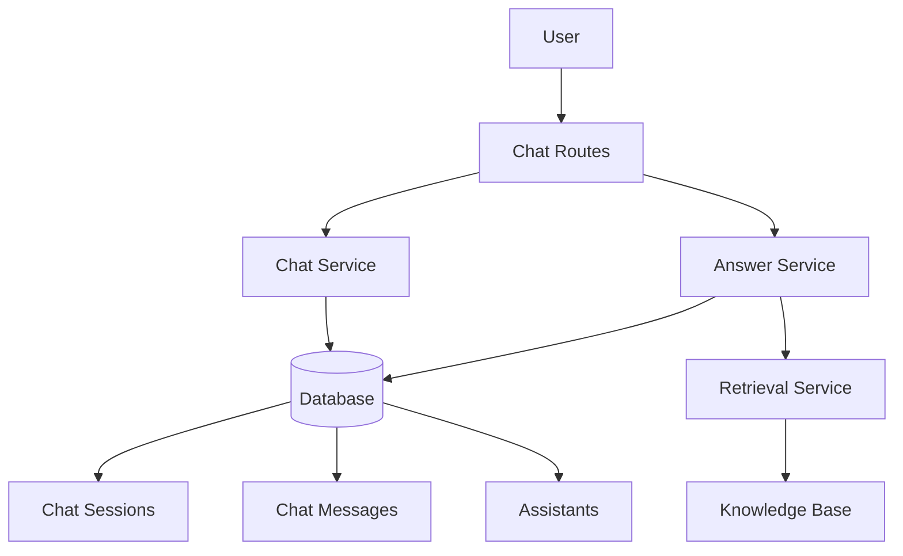

# Chat Context Implementation

This document explains how chat messages are associated with chat sessions and how context from knowledge bases is used to provide better answers.

## Architecture Overview



## Key Components

### 1. Database Models

#### ChatSessionORM

- Represents a chat session
- Linked to a dataset/knowledge base
- Can be associated with an assistant
- Contains session metadata and configuration

#### ChatMessageORM

- Represents individual messages within a session
- Belongs to a specific session
- Contains role (user/assistant/system), content, and metadata

#### AssistantORM

- Represents an AI assistant
- Associated with knowledge bases (datasets)
- Contains model configuration and system prompts

### 2. Services

#### ChatService

Handles basic session and message operations:

- Creating sessions
- Listing sessions
- Getting session details
- Updating sessions
- Deleting sessions
- Retrieving messages

#### AnswerService

Handles context-aware responses:

- Building context-aware prompts
- Saving messages to database
- Generating AI responses using session context
- Retrieving conversation history

### 3. Routes

#### Session Management

- `POST /sessions` - Create new chat session
- `GET /sessions` - List chat sessions
- `GET /sessions/{session_id}` - Get session details
- `PUT /sessions/{session_id}` - Update session
- `DELETE /sessions/{session_id}` - Delete session
- `GET /sessions/{session_id}/messages` - Get session messages

#### Context Management

- `GET /sessions/{session_id}/context` - Get full session context
- `GET /sessions/{session_id}/context/summary` - Get session context summary
- `GET /sessions/{session_id}/context/conversation-summary` - Get conversation summary
- `POST /sessions/{session_id}/context/clear` - Clear session context

#### Chat Interaction

- `POST /chat` - Send message and get response
- `POST /chat/enhanced` - Send message with enhanced context

## Implementation Details

### Message Association with Sessions

Messages are automatically associated with sessions through the `session_id` foreign key in the [ChatMessageORM](file:///d:/AI/Raptor-service/db/models/chat.py#L79-L116) model. When a message is saved, it's linked to a specific session.

### Knowledge Base Utilization

When a session is created, it's associated with a specific dataset (knowledge base). During chat interactions:

1. The user's query is used to retrieve relevant passages from the knowledge base
2. The retrieved context is combined with conversation history
3. An enhanced prompt is built using both context and history
4. The AI generates a response based on this enriched prompt

### Context-Aware Responses

The system maintains conversation context by:

1. Storing all messages in the database with their roles
2. Retrieving recent message history when building prompts
3. Including system prompts and assistant configurations
4. Combining all context with retrieved knowledge base passages

## API Usage Examples

### Creating a Session

```bash
curl -X POST http://localhost:8000/v1/datasets/chat/sessions \
  -H "Content-Type: application/json" \
  -d '{
    "dataset_id": "dataset-123",
    "title": "My Chat Session",
    "assistant_id": "assistant-456"
  }'
```

### Sending a Message

```bash
curl -X POST http://localhost:8000/v1/datasets/chat/chat \
  -H "Content-Type: application/json" \
  -d '{
    "query": "What is machine learning?",
    "dataset_id": "dataset-123",
    "session_id": "session-789"
  }'
```

### Getting Session Context

```bash
curl -X GET http://localhost:8000/v1/datasets/chat/sessions/session-789/context
```

## Best Practices

1. **Session Management**: Always associate sessions with specific datasets/knowledge bases
2. **Context Length**: Monitor conversation length to prevent context overflow
3. **Message Storage**: All messages should be saved for context continuity
4. **Error Handling**: Properly handle cases where sessions or datasets don't exist
5. **Performance**: Limit the number of historical messages retrieved for prompt building
