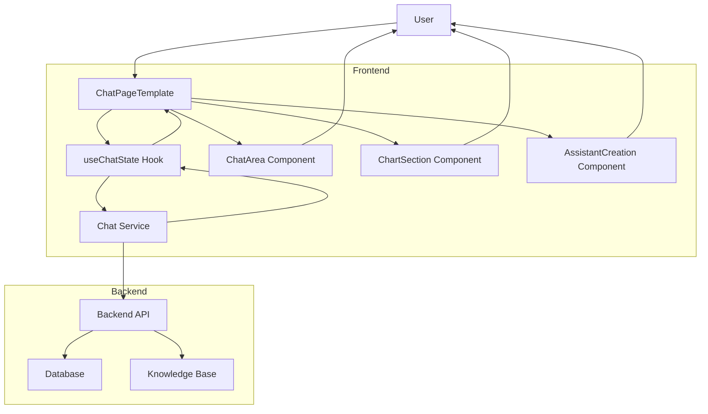
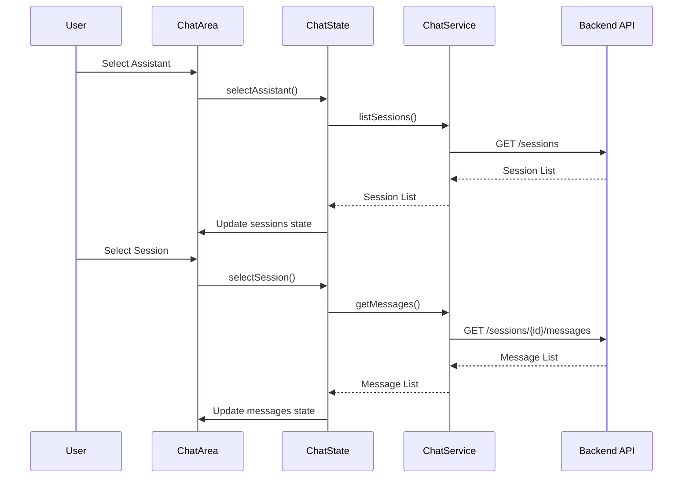
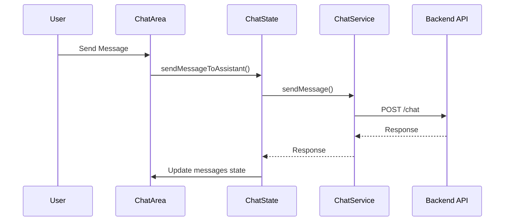
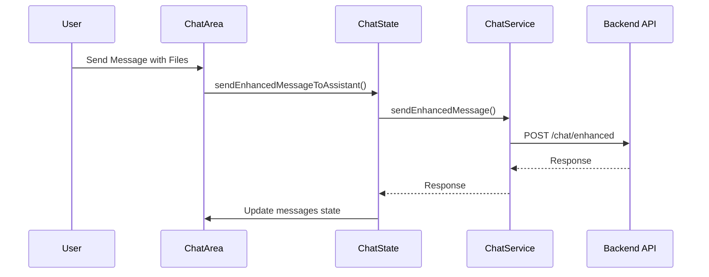

# Chat Integration Flow

## Component Interaction Flow

1. **User Interaction**

   - User selects an assistant in AssistantCreation
   - User selects or creates a session in ChartSection
   - User sends messages in ChatArea

2. **State Management**

   - useChatState manages all chat-related state
   - Automatically loads sessions when assistant changes
   - Automatically loads messages when session changes

3. **API Communication**

   - ChatService handles all API calls
   - Provides methods for session management
   - Provides methods for message handling
   - Provides methods for context-aware responses

4. **Data Flow**
   - Assistant selection → Load sessions
   - Session selection → Load messages
   - Message sending → API call → Update UI
   - Context retrieval → Enhanced responses

## Key Implementation Details

### Session Management

### Message Sending

### Enhanced Message Sending

This flow ensures a smooth, context-aware chat experience with proper state management and API integration.
